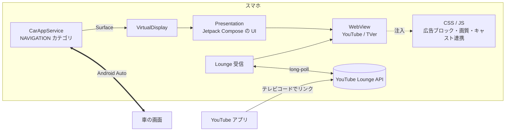

<div align="center">

# aweauto

**Android Auto で YouTube と TVer を、Google TV のような画面で見るアプリ**

root 化も Android Auto の改造も要りません。アプリを手動でインストールできるスマホなら動きます。

[English](README.md) | 日本語


</div>

> [!WARNING]
> 同乗者向け、運転手は**停車中のみ**を想定したアプリです。運転中の動画視聴は危険で、道路交通法違反にもなります。

## 特長

- 📺 **Google TV 風のホーム**：大きなバナー、横スクロールの棚、タブ、時計、再生履歴。車の画面でタッチ操作しやすいように作っています。
- ▶️ **YouTube と TVer を車の画面向けに調整**：サイトごとに CSS / JS を差し込み、次のように見た目と動きを変えます。サイトごとに設定で OFF にできます。
  - ダークテーマ
  - 検索結果を3列のグリッドで表示
  - プレーヤーを画面いっぱいに表示
  - ミュートの自動解除
  - TVer の再生前アンケートに自動で回答
  - ショート動画、アプリへの誘導バナー、下のタブバーを非表示
- 🕶️ **再生中は動画だけを表示**：再生中は左の操作レールを隠します。左端の小さなつまみを押すと、また出てきます。
- ⏳ **読み込み中の画面**：再生が始まるまでは、WebView の灰色の枠の代わりに、サムネイルと読み込み表示を出します。
- 📲 **スマホから車の画面に送る**
  - YouTube / TVer アプリの「共有 → 車の画面で開く」
  - 公式 YouTube アプリの**キャストボタン**
    - 同じ Wi-Fi・テザリングにいれば、キャストメニューに **aweauto (車)** が自動で出ます（DIAL）。コードは要りません。
    - それ以外は、最初の一度だけ「テレビコードでリンク」（Lounge API）でリンクします。モバイル回線のままでも使えます。車の画面にコードと QR を出し、スマホには「コードをコピーして YouTube を開く」ボタンがあります。
  - 共有メニューの一番上の列（ダイレクトシェア）に「車の画面」を出します。
- 🛡️ **広告ブロック**
  - AdGuard DNS フィルタ、EasyList、AdGuard 日本語フィルタから、ドメイン単位のルールを使います。リストは1日1回自動で更新します。
  - YouTube の動画広告は、プレーヤーに渡る設定から広告の予定を取り除いて消します。
- 📶 **圏外に強い**
  - **TVer は再生を始めた番組を、裏で最後まで端末に保存します。** 再生リストに載っている HLS のセグメントを全部ダウンロードし、プレーヤーにはディスクから渡します。保存が済んだ番組は、トンネルや圏外でも止まりません。
  - 画質の上限（自動 / 720p / 480p / 360p）を両サイトに適用できます。YouTube の先読みを増やす設定もありますが、実験的な機能です。
- 🗺️ **動画の横に地図アプリ**（[Shizuku](https://shizuku.rikka.app/) が必要）
  - 本物の Google マップや Y!マップなど、スマホに入っている地図・カーナビアプリを動画の横に出して、そのまま操作できます。
  - 左右に並べる・入れ替える・幅を変える・地図を縦長の小窓（PiP）にする、を切り替えられます。
  - 地図アプリは自動で探して選択肢に出します。Waze は Android Auto 接続中に自分の画面を塞いでしまうので出しません。
  - 車につないだときに Shizuku が止まっても、aweauto が自分で起動し直します（最初に一度 `scripts/aw.sh tcpip` が必要）。
- 🧭 **車の HUD・メーターに道案内**：ナビ中の地図アプリの通知（曲がる方向・距離・道路名・到着予定）を読み、Android Auto のナビ用の仕組みで車に送ります。どこまで表示されるかは車によります。通知へのアクセスの許可が必要です。

## スクリーンショット

| | |
|:-:|:-:|
|  ホーム |  ライブラリ（再生履歴） |
|  YouTube 検索（3列グリッド） |  YouTube（再生中は動画だけ表示） |
|  読み込み中の画面 |  設定 |
|  TVer（ダークテーマ） |  TVer（画面いっぱいに再生） |

<sub>Android Auto の Desktop Head Unit（1280×720）で撮影しました。動画は [ダイアン公式チャンネル](https://www.youtube.com/@daian_youandtube) と TVer のものです。</sub>

## 仕組み



- **車の画面への描画**：Car App Library では、ナビアプリが地図を自前で描くための描画領域（`Surface`）を受け取れます。aweauto はこれを `VirtualDisplay` にして、その上に Compose の `Presentation` を出しています。こうすることで、車の画面に好きな UI を描けます。
- **タッチ操作**：Android Auto からはタップの座標とスクロール量しか届きません。`TouchInjector` がそれを `MotionEvent` に組み立て直して、UI に渡しています。
- **サイトの調整**：CSS / JS は [`app/src/main/assets`](app/src/main/assets) に置いています。`WebViewCompat.addDocumentStartJavaScript` を使い、ページが読み込まれる前に差し込みます。
- **裏でのダウンロード（TVer）**：`HlsPrefetcher` が HLS の再生リストを横取りします。マスターの再生リストを画質1本に絞るので、再生中に画質が切り替わりません。そのうえで全セグメントと AES 鍵を 2GB のディスクキャッシュ（古いものから削除）に保存し、プレーヤーの要求にはディスクから返します。プレーヤー自身が溜める量（MSE）は少ないままなので、容量超過も起きません。
- **キャスト**：YouTube Lounge（MDX）の受信側の仕組みを Kotlin で実装したものです。受信側の ID を保存し、bind の long-poll をつなぎ続けて、再生状態をスマホに送り返します。

## 使い方

### 必要なもの

- Android 9 以上で、Android Auto が入っているスマホ
- JDK 17 と Android SDK（platform 35）
- 地図枠を使うなら：adb から起動した [Shizuku](https://shizuku.rikka.app/)（`scripts/aw.sh shizuku`）

### ビルドとインストール

Android Auto は、Play ストア以外から入れたナビアプリを一覧に出しません。そのため、インストール元を Play ストアに指定して入れます。

```bash
./gradlew :app:assembleDebug
adb install -r -i com.android.vending app/build/outputs/apk/debug/app-debug.apk
```

続いて、Android Auto 側で次の設定をします。

1. Android Auto の設定で「バージョン」を10回タップして、開発者モードにします。
2. ⋮ → 「デベロッパー向けの設定」→「提供元不明のアプリ」を ON にします。
3. 車につなぎ直すと、ランチャーに **aweauto** が出ます。

### YouTube アプリからキャストする

- **同じ Wi-Fi・テザリングにいるとき**：YouTube のプレーヤーのキャストボタンから **aweauto (車)** を選ぶだけです。
- **それ以外（最初の一度だけ）**：
  1. 車の画面のホームでキャストのアイコンを押すと、12桁のテレビコードと QR が出ます。
  2. YouTube アプリの「マイページ → 設定 → テレビで見る → テレビコードでリンク」で、そのコードを入力します。aweauto を入れたスマホなら「コードをコピーして YouTube を開く」ボタンが使えます。
  3. これ以降は、キャストメニューに **aweauto (車)** が出続けます。

## 開発

よく使う操作は [`scripts/aw.sh`](scripts/aw.sh) にまとめています（引数なしで一覧が出ます）。

| コマンド | 内容 |
|---|---|
| `scripts/aw.sh deploy` | ビルドしてインストール（インストール元を Play ストアにする） |
| `scripts/aw.sh dhu` / `dhu-720` | 車なしで試すための [Desktop Head Unit](https://developer.android.com/training/cars/testing/dhu) を起動 |
| `scripts/aw.sh send <url>` | YouTube / TVer の URL を車の画面で開く |
| `scripts/aw.sh shizuku` / `tcpip` | Shizuku を起動 / aweauto が自分で起動し直せるようにする |
| `scripts/aw.sh mute on` | デバッグ中は動画をミュートにする（debug ビルド） |
| `scripts/aw.sh e2e-map` | 地図枠の実機 E2E（下記） |
| `scripts/aw.sh readme-shots` | README のスクリーンショットを DHU から撮る |

- **車なしで動作確認する**：`sdkmanager "extras;google;auto"` で DHU を入れ、Android Auto の開発者メニューで「ヘッドユニットサーバーを起動」を押してから `scripts/aw.sh dhu` を実行します。
- **CSS を調整する**：debug ビルドは WebView のリモートデバッグが有効です。`chrome://inspect`（または `scripts/aw.sh devtools`）で実際の DOM を見ながら `assets/css/*.css` を編集できます。
- **地図枠の E2E**：DHU か実車で aweauto を分割表示にした状態で `scripts/aw.sh e2e-map --apps all` を実行します。aweauto の再起動と、入っている地図アプリ全部への切り替えを繰り返し、そのたびに地図が戻ること・`map_input` と地図の仮想ディスプレイが1個ずつのままなことを確かめます。サイズ変更とタップは、ターミナルから実行したときだけ手で試します（`--no-resize` で飛ばせます）。結果は `build/e2e/map-*/report.md` に出て、失敗があれば終了コードが 0 以外になります。
- **README のスクリーンショットを撮る**：起動中の DHU を閉じてから `scripts/aw.sh readme-shots` を実行します（`--only home,settings` で撮り直す画像を限定）。1280×720 の DHU が起動するので、案内された画面を開いて Enter を押すと `docs/screenshots` に保存されます。
- **テストを実行する**：`./gradlew :app:testDebugUnitTest`

## 制限

- **Android Auto 自身の表示は消せない**：下のシステムバーや、右上に重なる小さな戻るボタンは、アプリからは隠せません。
- **サイト側の変更で動かなくなることがある**：サイトごとの調整は、YouTube / TVer のページ構造やプレーヤーの内部に依存しています。
- **YouTube は丸ごとの先読みができない**：YouTube の Web プレーヤーは SABR という方式で動画を取得します。POST の中身でサーバーが返す部分を決めるため、WebView 側からは次の要求を予測することも、代わりに返すこともできません。先読みは約2分が上限です。
- **TVer は日本国内からのみ**：日本の IP アドレスが必要です。

## 免責事項

- 個人の非公式プロジェクトで、Google / YouTube / TVer とは関係ありません。
- 非公開の API を使い、他社の Web ページに手を加えているため、各サービスの利用規約に反する可能性があります。
- 利用は自己責任でお願いします。

## 謝辞

- [Fermata Auto](https://github.com/AndreyPavlenko/Fermata)：Android Auto に独自の UI を出せることを示してくれました。
- [yt-cast-receiver](https://github.com/patrickkfkan/yt-cast-receiver) と [plaincast](https://github.com/aykevl/plaincast)：Lounge API の仕組みを参考にしました。
- [AdGuard](https://github.com/AdguardTeam/AdGuardSDNSFilter) と [EasyList](https://easylist.to/)：フィルタリストを使わせてもらっています。
