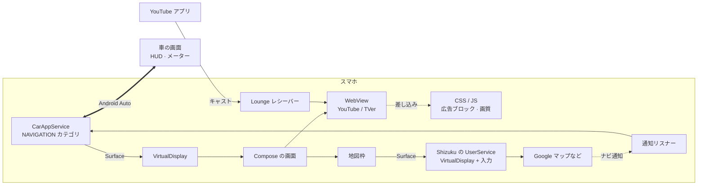

<div align="center">


# aweauto

**Android Auto で YouTube と TVer を。Google TV 風の画面で。**<br>
動画の横には本物の地図アプリ。その道案内は車の HUD にも出ます。

root 不要 · Android Auto は改造しない · アプリを1つ入れるだけ

[](#インストール)
[](app)
[](app)
[](https://developer.android.com/training/cars/apps)

[特長](#特長) · [スクリーンショット](#スクリーンショット) · [インストール](#インストール) · [しくみ](#しくみ) · [開発](#開発)

[English](README.md) · 日本語

<br>


</div>

> [!WARNING]
> 同乗者向けのアプリです。運転手が使うのは**停車中だけ**にしてください。運転中の動画視聴は危険で、道路交通法違反にもなります。

## 特長

<table>
<tr>
<td width="33%" valign="top">

### 📺 Google TV 風のホーム
大きなバナー、横スクロールの棚、再生履歴、時計。車の画面でタッチしやすい大きさにしています。

</td>
<td width="33%" valign="top">

### ▶️ YouTube と TVer を車向けに
ダークテーマ、3列のグリッド、画面いっぱいのプレーヤー、ミュートの自動解除。ショートやアプリへの誘導は消します。

</td>
<td width="33%" valign="top">

### 📲 スマホからキャスト
公式 YouTube アプリのキャストボタンから送れます。どのアプリからでも「共有 → 車の画面」で送れます。

</td>
</tr>
<tr>
<td valign="top">

### 🗺️ 動画の横に地図アプリ
本物の Google マップや Y!マップを動画の横に出して、そのまま操作できます。幅の変更・左右の入れ替え・小窓にも対応しています。

</td>
<td valign="top">

### 🧭 道案内を HUD に
ナビ中の地図アプリの案内を、車のヘッドアップディスプレイやメーターに送ります。

</td>
<td valign="top">

### 📶 圏外に強い
TVer は見ている番組を裏で端末に保存するので、トンネルでも止まりません。通信が遅いときは画質の上限も決められます。

</td>
</tr>
<tr>
<td valign="top">

### 🛡️ 広告ブロック
AdGuard DNS・EasyList・AdGuard 日本語フィルタのルールで止めます。YouTube の動画広告も消します。

</td>
<td valign="top">

### 🕶️ 再生中は動画だけ
再生中は横の操作レールを隠します。再生が始まるまでは、灰色の枠の代わりにサムネイルを出します。

</td>
<td valign="top">

### 🔁 中断しても続きから
バックカメラや画面の切り替えのあとも、動画と地図はそのまま続きます。つないだときに止まった Shizuku も、自動で起動し直します。

</td>
</tr>
</table>

<details>
<summary><b>くわしく</b></summary>

- **サイトごとの調整**：サイトごとに CSS / JS を差し込んで、次のように変えます。サイトごとに設定で OFF にできます。
  - ダークテーマ、3列の検索グリッド、画面いっぱいのプレーヤー、ミュートの自動解除
  - TVer の再生前アンケートに自動で回答
  - ショート・アプリへの誘導バナー・下のタブバーを非表示
- **キャスト**
  - 同じ Wi-Fi・テザリングにいれば、YouTube のキャストメニューに **aweauto (車)** が自動で出ます（DIAL）。
  - それ以外は、最初に一度だけ「テレビコードでリンク」（Lounge プロトコル）でつなぎます。モバイル回線でも使えます。コードと QR は車の画面に出ます。
  - 共有メニューの一番上の列（ダイレクトシェア）にも「車の画面」を出します。
- **広告ブロック**：フィルタリストは1日1回更新します。YouTube の動画広告は、プレーヤーに渡る応答から取り除きます。
- **TVer の保存**：見ている番組の HLS のセグメントを全部、2 GB のディスクキャッシュに保存して、そこからプレーヤーに渡します。
- **画質の上限**：自動・720p・480p・360p から選べて、両サイトに効きます。YouTube の先読みを長くする設定もありますが、実験的な機能です。
- **地図枠**（[Shizuku](https://shizuku.rikka.app/) が必要）
  - ホーム画面から起動できる地図・カーナビアプリを自動で探して、選択肢に出します。
  - Waze は出しません。Android Auto につないでいる間、自分の画面を塞いでしまうためです。
  - 小窓は縦長（3:4）です。地図枠が小さいときは、地図アプリに低い密度で描かせるので窮屈になりません。
- **HUD・メーター**
  - 地図アプリのナビ通知から、曲がる方向・距離・道路名・残り時間・到着時刻を読み取ります。
  - それを Android Auto の `NavigationManager` で車に送ります。
  - どこまで表示されるかは車によります。通知へのアクセスの許可が必要です。

</details>

## スクリーンショット

<table>
<tr>
<td width="50%"><br><sub><b>ホーム</b>（バナーと棚）</sub></td>
<td width="50%"><br><sub><b>YouTube</b>（再生中は動画だけ）</sub></td>
</tr>
<tr>
<td><br><sub><b>動画の横に Google マップ</b>（入れ替え・幅の変更ができる）</sub></td>
<td><br><sub><b>地図を縦長の小窓に</b></sub></td>
</tr>
<tr>
<td><br><sub><b>YouTube 検索</b>（3列グリッド）</sub></td>
<td><br><sub><b>ライブラリ</b>（再生履歴）</sub></td>
</tr>
<tr>
<td><br><sub><b>TVer</b>（ダークテーマ）</sub></td>
<td><br><sub><b>TVer</b>（画面いっぱいに再生）</sub></td>
</tr>
<tr>
<td><br><sub><b>読み込み中の画面</b>（灰色の枠の代わり）</sub></td>
<td><br><sub><b>設定</b></sub></td>
</tr>
</table>

<sub>Android Auto の Desktop Head Unit（1280×720）で撮影。動画は [ダイアン公式チャンネル](https://www.youtube.com/@daian_youandtube) と TVer のものです。</sub>

## インストール

**必要なもの**：Android Auto が入った Android 9 以上のスマホ。ビルドには JDK 17 と Android SDK（platform 35）が要ります。

**1. ビルドしてインストール**：Android Auto は、Play ストア以外から入れたナビアプリを一覧に出しません。そのため、インストール元を Play ストアにして入れます。

```bash
scripts/aw.sh deploy
```

<sub>中身は <code>./gradlew :app:assembleDebug</code> と <code>adb install -r -i com.android.vending app/build/outputs/apk/debug/app-debug.apk</code> です。</sub>

**2. Android Auto で許可する**：Android Auto の設定で「バージョン」を10回タップします。次に ⋮ →「デベロッパー向けの設定」→「提供元不明のアプリ」を ON にします。車につなぎ直すと、ランチャーに **aweauto** が出ます。

**3. 必要に応じて**

| 使いたい機能 | 最初に一度だけやること |
|---|---|
| 🗺️ 地図枠 | [Shizuku](https://shizuku.rikka.app/) を入れて、`scripts/aw.sh shizuku` で起動します。続けて `scripts/aw.sh tcpip` をしておくと、車の中で止まっても aweauto が起動し直します。 |
| 🧭 HUD の道案内 | aweauto の設定 →「通知へのアクセス」→ aweauto を許可 |
| 📲 Wi-Fi 以外でのキャスト | 車の画面のホームでキャストのアイコンを押します。YouTube アプリの「マイページ → 設定 → テレビで見る → テレビコードでリンク」で、表示されたコードを入力します。 |

## しくみ



- **車の画面に描く**：Car App Library は、*ナビ*アプリに描画先の `Surface` をそのまま渡します。aweauto はそれを `VirtualDisplay` にして、Compose の `Presentation` を表示します。これで、どんな画面でも車に出せます。車からのタップとスクロールは、`MotionEvent` に組み立て直して画面に渡します。
- **地図枠**
  - [Shizuku](https://shizuku.rikka.app/) の UserService が shell 権限で動きます。地図枠の描画先に2つ目の `VirtualDisplay` を作り、そこで地図アプリを起動します。
  - タッチは `InputForwarder` でそのディスプレイに送ります。
  - 地図枠の大きさが変わっても、ディスプレイは作り直さず大きさだけ変えます。なので、地図アプリは止まりません。
- **HUD の道案内**：通知リスナーが地図アプリのナビ通知を読み取り、`NavigationManager.updateTrip` で車に送ります。
- **サイトの調整**：[`app/src/main/assets`](app/src/main/assets) の CSS / JS を、`WebViewCompat.addDocumentStartJavaScript` でページの読み込み開始時に差し込みます。
- **TVer の保存**：`HlsPrefetcher` が HLS のマスタープレイリストを1つの画質に絞ります。そのうえで、セグメントと鍵を全部ディスクに保存し、プレーヤーにはそこから渡します。なので、プレーヤー自身のバッファは小さいままです。
- **キャスト**：YouTube の Lounge（MDX）の画面側プロトコルを Kotlin に移植したものと、同じネットワーク向けの DIAL サーバーです。

## 開発

よく使う操作は [`scripts/aw.sh`](scripts/aw.sh) にまとめています。引数なしで実行すると、全部の一覧が出ます。

| コマンド | 内容 |
|---|---|
| `scripts/aw.sh deploy` | ビルドしてインストール |
| `scripts/aw.sh dhu` | 車なしで試すための [Desktop Head Unit](https://developer.android.com/training/cars/testing/dhu) を起動 |
| `scripts/aw.sh send <url>` | YouTube / TVer の URL を車の画面で開く |
| `scripts/aw.sh logs` | aweauto のログを流す |
| `scripts/aw.sh devtools` | WebView を Chrome DevTools で調べる |
| `scripts/aw.sh mute on` | デバッグ中は動画をミュートにする |
| `scripts/aw.sh e2e-map --apps all` | 地図枠の実機 E2E |
| `scripts/aw.sh readme-shots` | README のスクリーンショットを DHU で撮り直す |
| `./gradlew :app:testDebugUnitTest` | 単体テスト |

<details>
<summary><b>DHU・E2E・スクリーンショットについて</b></summary>

- **DHU**：`sdkmanager "extras;google;auto"` で入れます。Android Auto の開発者メニューで「ヘッドユニットサーバーを起動」を押してから、`scripts/aw.sh dhu` を実行します。
- **地図枠の E2E**
  - DHU か実車で aweauto を分割表示にしてから、`scripts/aw.sh e2e-map --apps all` を実行します。
  - aweauto の再起動と、入っている地図アプリ全部への切り替えを繰り返します。そのたびに、地図が戻ること、地図用のサービスと仮想ディスプレイが1個ずつのままなことを確かめます。
  - ターミナルから実行したときは、サイズ変更とタップも手で試します（`--no-resize` で飛ばせます）。
  - 結果は `build/e2e/map-*/report.md` に出ます。失敗があれば、終了コードが 0 以外になります。
- **スクリーンショット**：起動中の DHU を閉じてから `scripts/aw.sh readme-shots` を実行します。一部だけ撮り直すときは `--only home,settings` を付けます。
  - 1280×720 の DHU が起動するので、案内された画面を開いて Enter を押します。
  - 地図の画像では、地図に東京を出すので、自宅やアカウントは写りません。
  - 撮ったあとに `python3 scripts/readme-hero.py` を実行すると、`docs/hero.png` を作り直せます（Pillow が必要）。

</details>

## 制限

- **Android Auto 自身の表示は消せない**：下のシステムバーや、重なって出る小さな戻るボタンは、アプリからは隠せません。
- **サイトの変更で動かなくなることがある**：調整は、YouTube / TVer のページ構造やプレーヤーの内部に依存しています。
- **YouTube は丸ごとの先読みができない**：Web プレーヤーが SABR という方式で動画を取りに行きます。その POST の要求は、WebView 側からは予測することも代わりに返すこともできません。先読みは約2分が上限です。
- **TVer は日本国内からのみ**：日本の IP アドレスが必要です。
- **HUD に出るかは車しだい**：純正ナビ以外の案内を HUD に出さない車もあります。

## 免責

aweauto は非公式の個人プロジェクトで、Google・YouTube・TVer とは関係ありません。公開されていない API を使い、他社のページを書き換えるので、各サービスの利用規約に反するおそれがあります。自己責任で使ってください。

## 謝辞

- [Fermata Auto](https://github.com/AndreyPavlenko/Fermata)：Android Auto に独自の画面を出せることを示してくれました。
- [yt-cast-receiver](https://github.com/patrickkfkan/yt-cast-receiver)、[plaincast](https://github.com/aykevl/plaincast)：Lounge プロトコルの資料になりました。
- [Shizuku](https://github.com/RikkaApps/Shizuku)：地図枠を実現できたのはこれのおかげです。
- [AdGuard](https://github.com/AdguardTeam/AdGuardSDNSFilter)、[EasyList](https://easylist.to/)：フィルタリストを提供しています。
