<div align="center">


# aweauto

**YouTube and TVer on Android Auto, in a Google TV–style UI.**<br>
Your real map app runs right beside the video, and its turn-by-turn goes to the car's HUD.

No root · Android Auto stays untouched · Just sideload one app

[](#install)
[](app)
[](app)
[](https://developer.android.com/training/cars/apps)

[Features](#features) · [Screenshots](#screenshots) · [Install](#install) · [How it works](#how-it-works) · [Development](#development)

English · [日本語](README.ja.md)

<br>

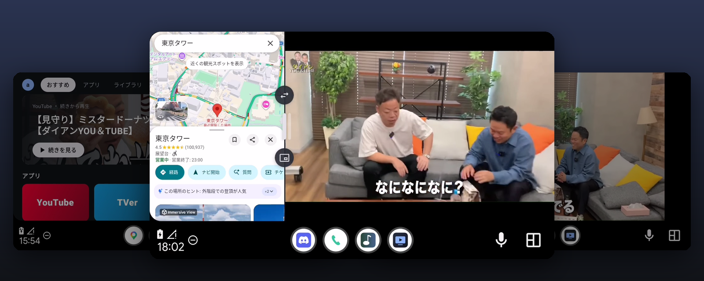

</div>

> [!WARNING]
> aweauto is for passengers, and for the driver **only while parked**. Watching video while driving is dangerous and illegal in most countries.

## Features

<table>
<tr>
<td width="33%" valign="top">

### 📺 Google TV–style home
Hero banner, shelves, a watch-history library and a clock, sized for a touchscreen in the dash.

</td>
<td width="33%" valign="top">

### ▶️ YouTube & TVer, tuned for the car
Dark theme, a 3-column grid, a full-bleed player, auto-unmute. Shorts and app banners are gone.

</td>
<td width="33%" valign="top">

### 📲 Cast from your phone
Tap the cast button in the official YouTube app. You can also share any video to "車の画面".

</td>
</tr>
<tr>
<td valign="top">

### 🗺️ Your map app, side by side
The real Google Maps or Yahoo! MAP runs next to the video. You can touch it, resize it, swap sides or shrink it to a picture-in-picture window.

</td>
<td valign="top">

### 🧭 Turn-by-turn on the HUD
The guidance of the map app you're navigating with goes to the car's head-up display and instrument cluster.

</td>
<td valign="top">

### 📶 Made for dead zones
TVer episodes are saved to disk as you watch, so tunnels don't stop them. You can cap the quality for slow networks.

</td>
</tr>
<tr>
<td valign="top">

### 🛡️ Ad blocking
AdGuard DNS, EasyList and AdGuard Japanese rules, plus YouTube video ads removed from the player.

</td>
<td valign="top">

### 🕶️ Immersive playback
The side rail hides while a video plays. Until playback starts, you see the thumbnail instead of a grey box.

</td>
<td valign="top">

### 🔁 Picks up where you left off
The video and map survive camera interruptions and screen switches. Shizuku is restarted on its own after you plug in.

</td>
</tr>
</table>

<details>
<summary><b>All the details</b></summary>

- **Site tweaks.** Each site gets its own CSS/JS: a dark theme, a 3-column search grid, a full-bleed player and auto-unmute. TVer's pre-roll survey is answered for you. Shorts, app banners and the bottom tab bar are hidden. Each site can be switched off in Settings.
- **Casting.**
  - On the same Wi-Fi or hotspot, **aweauto (車)** shows up in the YouTube cast menu by itself (DIAL).
  - Anywhere else, link once with *Link with TV code* (the Lounge protocol). This also works over mobile data. The code and a QR are shown on the car screen.
  - "車の画面" is also published as a direct-share target.
- **Ad blocking.** Domain rules from the filter lists are refreshed daily. YouTube video ads are stripped from the player response.
- **TVer offline cache.** Every HLS segment of the episode you're watching is downloaded into a 2 GB disk cache and served to the player from there.
- **Quality cap.** Auto, 720p, 480p or 360p, for both sites. *Experimental:* a longer read-ahead for YouTube.
- **Map pane** *(needs [Shizuku](https://shizuku.rikka.app/))*.
  - Any installed map or navigation app that can be opened from the home screen is offered automatically.
  - Waze is left out, because it locks its own screen while Android Auto is connected.
  - The PiP window is portrait (3:4). Map apps are drawn at a lower density in small panes, so they don't feel cramped.
- **HUD and instrument cluster.**
  - aweauto reads the navigation notification of the map app (turn, distance, road, remaining time and arrival time).
  - It then sends that to the car through Android Auto's `NavigationManager`.
  - What actually appears depends on the car. This needs notification access.

</details>

## Screenshots

<table>
<tr>
<td width="50%">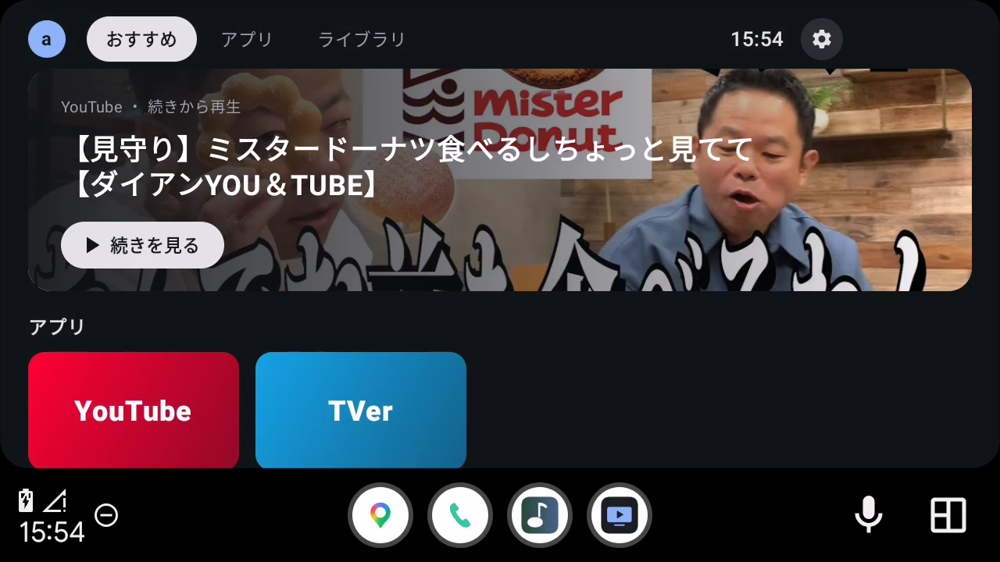<br><sub><b>Home</b>, with the hero banner and shelves</sub></td>
<td width="50%">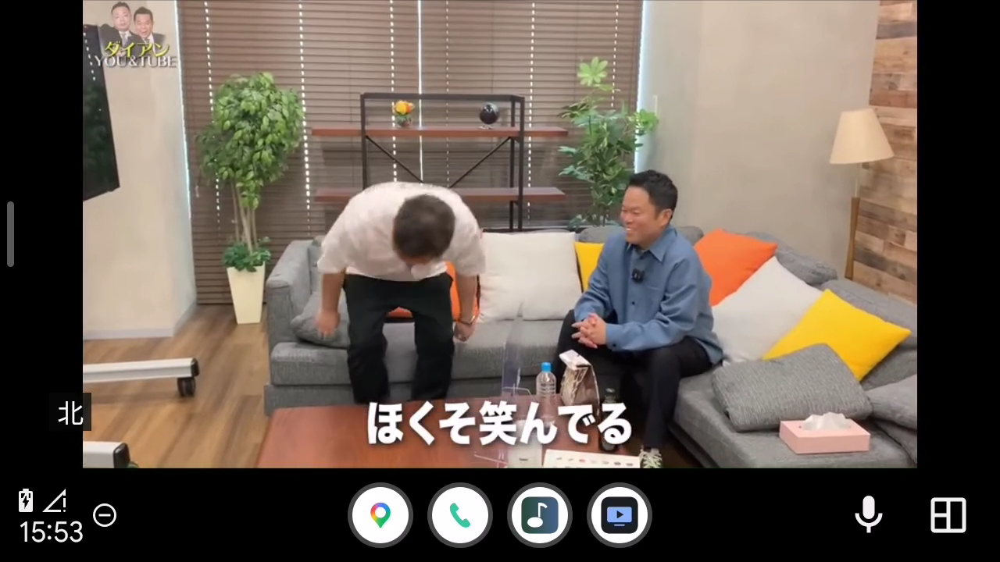<br><sub><b>YouTube</b>, immersive player</sub></td>
</tr>
<tr>
<td>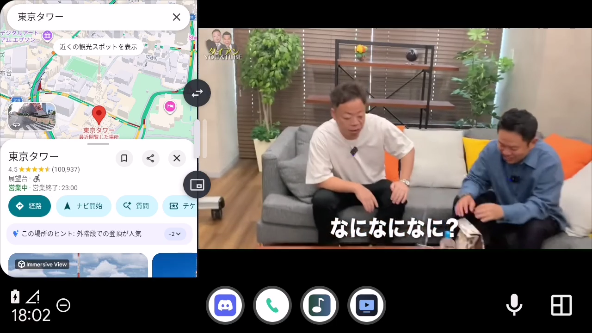<br><sub><b>Google Maps beside the video</b>, swap sides or drag the width</sub></td>
<td>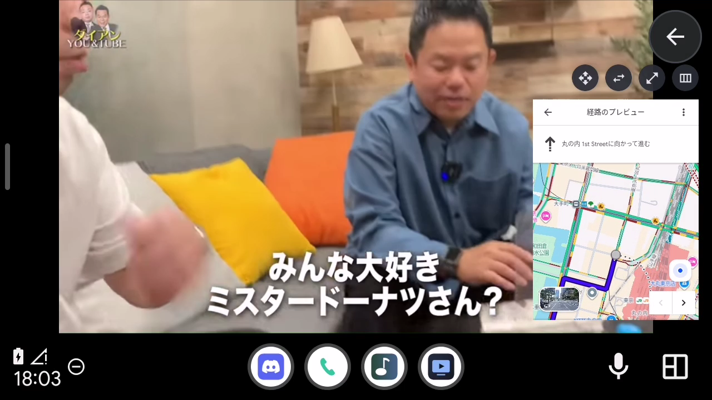<br><sub><b>Map as a picture-in-picture window</b>, portrait</sub></td>
</tr>
<tr>
<td>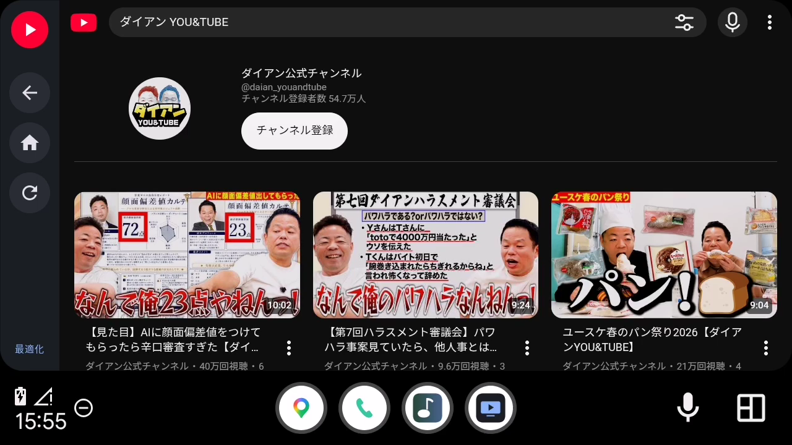<br><sub><b>YouTube search</b>, 3-column grid</sub></td>
<td>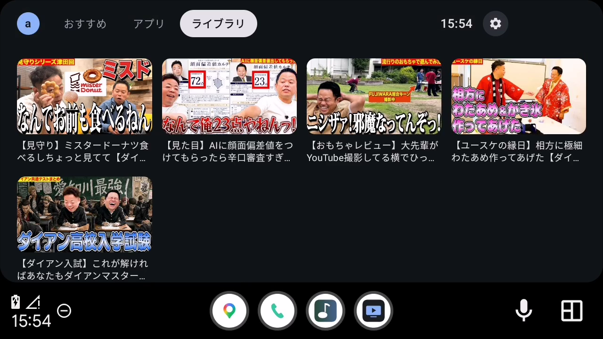<br><sub><b>Library</b> (watch history)</sub></td>
</tr>
<tr>
<td>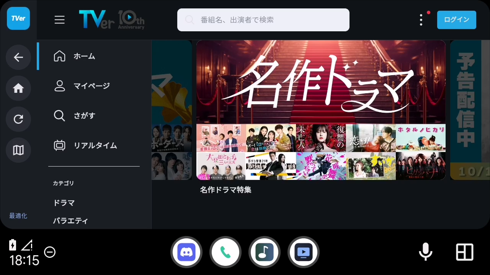<br><sub><b>TVer</b>, dark theme</sub></td>
<td>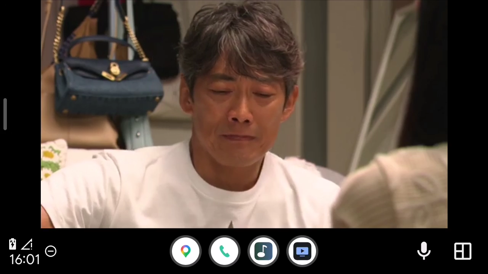<br><sub><b>TVer</b>, full-bleed player</sub></td>
</tr>
<tr>
<td>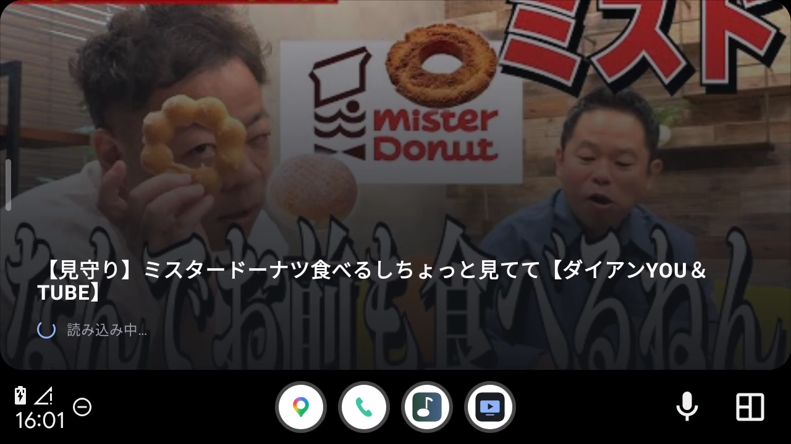<br><sub><b>Loading cover</b> instead of WebView's grey box</sub></td>
<td>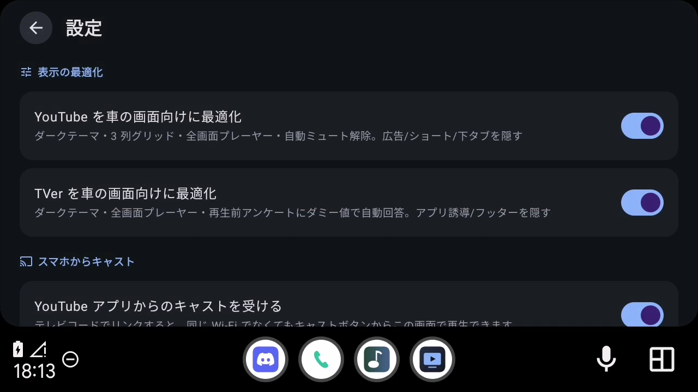<br><sub><b>Settings</b></sub></td>
</tr>
</table>

<sub>Taken on the Android Auto Desktop Head Unit at 1280×720. Videos are from [ダイアン公式チャンネル](https://www.youtube.com/@daian_youandtube) and TVer.</sub>

## Install

**You need** an Android 9+ phone with Android Auto, and JDK 17 with the Android SDK (platform 35) to build.

**1. Build and install.** Android Auto hides navigation apps that didn't come from the Play Store, so install with the Play Store as the installer:

```bash
scripts/aw.sh deploy
```

<sub>That runs <code>./gradlew :app:assembleDebug</code>, then <code>adb install -r -i com.android.vending app/build/outputs/apk/debug/app-debug.apk</code>.</sub>

**2. Allow it in Android Auto.** In Android Auto settings, tap **Version** 10 times. Then open ⋮ → **Developer settings** and turn on **Unknown sources**. Reconnect to the car, and **aweauto** appears in the launcher.

**3. Optional extras.**

| For | Do this once |
|---|---|
| 🗺️ Map pane | Install [Shizuku](https://shizuku.rikka.app/) and start it with `scripts/aw.sh shizuku`. After that, `scripts/aw.sh tcpip` lets aweauto restart Shizuku by itself in the car. |
| 🧭 HUD guidance | aweauto Settings → **Notification access** → allow aweauto |
| 📲 Casting away from Wi-Fi | Tap the cast icon on the car home screen. In the YouTube app, go to **You → Settings → Watch on TV → Link with TV code** and enter the code shown. |

## How it works

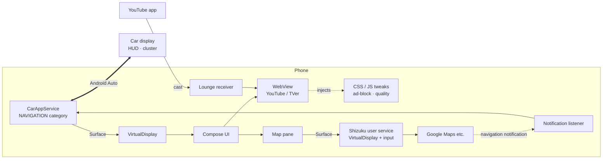

- **Drawing on the car screen.** A *navigation* app gets a raw `Surface` from the Car App Library. aweauto turns it into a `VirtualDisplay` and shows a Compose `Presentation` on it, so any UI can run there. Taps and scrolls from the host are rebuilt into `MotionEvent`s.
- **The map pane.**
  - A [Shizuku](https://shizuku.rikka.app/) user service runs with shell privileges. It creates a second `VirtualDisplay` on the pane's surface and launches the map app on it.
  - Touches go to that display through an `InputForwarder`.
  - When the pane is resized, the display is resized rather than recreated, so the map app keeps running.
- **HUD guidance.** A notification listener parses the map app's navigation notification and sends it to the car with `NavigationManager.updateTrip`.
- **Site tweaks.** The CSS and JS in [`app/src/main/assets`](app/src/main/assets) are injected at document start with `WebViewCompat.addDocumentStartJavaScript`.
- **TVer cache.** `HlsPrefetcher` trims the HLS master playlist to one rendition. It then downloads every segment and key to disk and serves the player from there, so the player's own buffer stays small.
- **Casting.** A Kotlin port of the YouTube Lounge (MDX) screen protocol, plus a DIAL server for the local network.

## Development

[`scripts/aw.sh`](scripts/aw.sh) wraps everyday tasks. Run it with no arguments for the full list.

| Command | What it does |
|---|---|
| `scripts/aw.sh deploy` | Build and install |
| `scripts/aw.sh dhu` | Start the [Desktop Head Unit](https://developer.android.com/training/cars/testing/dhu) to try it without a car |
| `scripts/aw.sh send <url>` | Open a YouTube or TVer URL on the car screen |
| `scripts/aw.sh logs` | Follow aweauto's logs |
| `scripts/aw.sh devtools` | Inspect the WebView from Chrome DevTools |
| `scripts/aw.sh mute on` | Keep videos muted while you debug |
| `scripts/aw.sh e2e-map --apps all` | End-to-end test of the map pane on a real phone |
| `scripts/aw.sh readme-shots` | Retake the README screenshots from the DHU |
| `./gradlew :app:testDebugUnitTest` | Unit tests |

<details>
<summary><b>More on the DHU, E2E and screenshots</b></summary>

- **DHU.** Install it with `sdkmanager "extras;google;auto"`. Choose **Start head unit server** in Android Auto's developer menu, then run `scripts/aw.sh dhu`.
- **Map pane E2E.**
  - Open aweauto in split view on the DHU or in a car, then run `scripts/aw.sh e2e-map --apps all`.
  - It restarts aweauto several times and switches through every installed map app. Each time, it checks that the map comes back and that exactly one map service and one map display remain.
  - In a terminal, it also asks you to try resizing and taps by hand (`--no-resize` skips that).
  - The report goes to `build/e2e/map-*/report.md`, and the exit code is non-zero on failure.
- **Screenshots.** Close any running DHU, then run `scripts/aw.sh readme-shots`. Use `--only home,settings` to retake just some of them.
  - It starts a 1280×720 DHU. Open each requested screen and press Enter.
  - For the map shots, the map shows Tokyo, so your home and account don't appear.
  - Afterwards, `python3 scripts/readme-hero.py` rebuilds `docs/hero.png` (needs Pillow).

</details>

## Limitations

- **Android Auto's own UI stays.** Apps can't hide its system bar or the small back button it overlays.
- **Sites change.** The tweaks depend on YouTube's and TVer's pages and player internals, and may break when those change.
- **YouTube can't be cached ahead.** Its web player streams over SABR, whose POST requests can't be predicted or served from WebView. Read-ahead tops out at about 2 minutes.
- **TVer is Japan only.** It needs a Japanese IP address.
- **HUD support depends on the car.** Some cars only show their built-in navigation on the HUD.

## Disclaimer

aweauto is an unofficial personal project. It isn't affiliated with or endorsed by Google, YouTube or TVer. It uses undocumented APIs and modifies third-party web pages, which may be against those services' terms. Use it at your own risk.

## Acknowledgements

- [Fermata Auto](https://github.com/AndreyPavlenko/Fermata) showed that custom UIs on Android Auto are possible.
- [yt-cast-receiver](https://github.com/patrickkfkan/yt-cast-receiver) and [plaincast](https://github.com/aykevl/plaincast) documented the Lounge protocol.
- [Shizuku](https://github.com/RikkaApps/Shizuku) makes the map pane possible.
- [AdGuard](https://github.com/AdguardTeam/AdGuardSDNSFilter) and [EasyList](https://easylist.to/) provide the filter lists.
