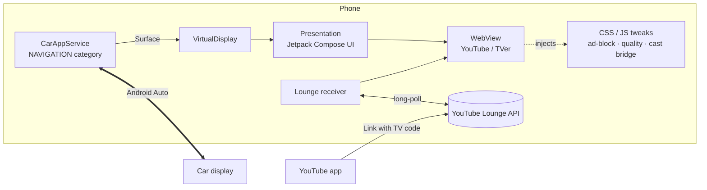

<div align="center">

# aweauto

**A Google TV–style player for YouTube and TVer on Android Auto.**

No root. You don't modify Android Auto. It runs on any phone that can sideload an app.

English | [日本語](README.ja.md)


</div>

> [!WARNING]
> aweauto is meant for passengers, and for the driver **only while parked**. Watching video while driving is dangerous and illegal in most countries.

## Features

- 📺 **Google TV–style home screen.** A hero banner, shelves, tabs, a clock and a history library, all designed for touch on a car display.
- ▶️ **YouTube and TVer, tuned for the car.** Per-site CSS/JS gives you:
  - a dark theme
  - a 3-column grid for search results
  - a full-bleed player
  - automatic unmute
  - automatic answers to TVer's pre-roll survey
  - no Shorts, app banners or bottom tab bar

  Each site can be switched off in Settings.
- 🕶️ **Immersive playback.** The side rail hides while a video plays. A small handle on the left edge brings it back.
- ⏳ **Loading cover.** Until playback starts you see the thumbnail and a spinner instead of WebView's grey placeholder.
- 📲 **Send from your phone.**
  - *Share → "車の画面で開く"* from the YouTube or TVer app.
  - **Cast from the official YouTube app.**
    - On the same Wi-Fi or tethering hotspot, **aweauto (車)** appears in the cast menu automatically (DIAL). No code needed.
    - Anywhere else, link once with *Link with TV code* (the Lounge protocol). This works over mobile data too. The code and a QR are shown on the car screen, and the phone has a copy-and-open button.
  - "車の画面" is published as a direct-share target, so it can appear at the top of the share sheet.
- 🛡️ **Ad blocking.**
  - Domain rules from AdGuard DNS, EasyList and AdGuard Japanese filters, refreshed daily.
  - YouTube video ads are stripped from the player response.
- 📶 **Made for dead zones.**
  - **TVer episodes are downloaded to disk in the background as you watch.** Every HLS segment listed in the playlist is fetched and then served to the player from disk. Once an episode is cached, tunnels and dead zones don't interrupt it.
  - A quality cap (auto/720p/480p/360p) applies to both sites. *Experimental:* a larger read-ahead for YouTube.

## Screenshots

| | |
|:-:|:-:|
|  Home |  Library (watch history) |
|  YouTube search, 3-column grid |  YouTube, immersive player |
|  Loading cover |  Settings |
|  TVer (dark theme) |  TVer, full-bleed player |

<sub>Screenshots were taken on the Android Auto Desktop Head Unit at 1280×720. The videos shown are from [ダイアン公式チャンネル](https://www.youtube.com/@daian_youandtube) and TVer.</sub>

## How it works



- **Drawing on the car screen.** The Car App Library lets a *navigation* app draw its own map onto a `Surface`. aweauto turns that surface into a `VirtualDisplay` and shows a Compose `Presentation` on it, so any UI can run on the car screen.
- **Touch input.** The host only reports taps and scroll deltas. `TouchInjector` rebuilds them into `MotionEvent`s and feeds them to the UI.
- **Site tweaks.** Stylesheets and scripts live in [`app/src/main/assets`](app/src/main/assets). They are injected at document start with `WebViewCompat.addDocumentStartJavaScript`.
- **Background download (TVer).** `HlsPrefetcher` intercepts the HLS playlists and trims the master playlist to one rendition so the player never switches quality. It then downloads every segment and AES key to a 2 GB LRU disk cache and answers the player's segment requests from disk. The player's own MSE buffer stays small, so the browser quota is never hit.
- **Casting.** Casting is a Kotlin port of the YouTube Lounge (MDX) screen protocol. It keeps a persistent screen ID and a bind long-poll, and reports playback state back to the phone.

## Getting started

### Requirements

- An Android 9+ phone with Android Auto installed
- JDK 17 and the Android SDK (platform 35)

### Build and install

Android Auto hides navigation apps that didn't come from the Play Store. To get around that, install with the Play Store as the installer:

```bash
./gradlew :app:assembleDebug
adb install -r -i com.android.vending app/build/outputs/apk/debug/app-debug.apk
```

Then enable unknown sources in Android Auto:

1. In Android Auto settings, tap **Version** 10 times to enable developer mode.
2. Open ⋮ → **Developer settings** and turn on **Unknown sources**.
3. Reconnect to the car. **aweauto** now appears in the app launcher.

### Casting from the YouTube app

- **Same Wi-Fi or hotspot:** just tap the cast button in the YouTube player and pick **aweauto (車)**.
- **Otherwise (first time only):**
  1. Tap the cast icon on the car home screen. The 12-digit TV code and a QR are shown.
  2. In the YouTube app, go to **You → Settings → Watch on TV → Link with TV code** and enter the code. On the phone running aweauto, use **Copy code & open YouTube** instead.
  3. After that, **aweauto (車)** stays in the cast menu.

## Development

- **Try it without a car.** Use the [Desktop Head Unit](https://developer.android.com/training/cars/testing/dhu):
  1. Install it with `sdkmanager "extras;google;auto"`.
  2. In Android Auto's developer menu, choose **Start head unit server**.
  3. Run `adb forward tcp:5277 tcp:5277 && ./desktop-head-unit`.
- **Tweak the CSS.** Debug builds enable WebView remote debugging, so you can inspect the live DOM from `chrome://inspect` while editing `assets/css/*.css`.
- **Send a URL from adb:**

  ```bash
  adb shell am start -a android.intent.action.SEND -t text/plain \
    --es android.intent.extra.TEXT "https://youtu.be/VIDEO_ID" \
    -n com.h1rose.aweauto/.ShareActivity
  ```
- **Run the tests:** `./gradlew :app:testDebugUnitTest`

## Limitations

- **Android Auto's own UI stays.** The system bar and the small back button that Android Auto overlays can't be hidden by an app.
- **Site changes break things.** The site tweaks depend on YouTube's and TVer's DOM and player internals, and can stop working when those sites change.
- **YouTube can't be cached ahead.** Its web player streams over SABR, which sends POST requests whose body decides what the server returns, so WebView can't predict or serve those requests. Its read-ahead tops out at about 2 minutes.
- **TVer is Japan only.** TVer needs a Japanese IP address.

## Disclaimer

- aweauto is an unofficial personal project. It isn't affiliated with or endorsed by Google, YouTube or TVer.
- It uses undocumented APIs and modifies third-party web pages, which may be against those services' terms of use.
- Use it at your own risk.

## Acknowledgements

- [Fermata Auto](https://github.com/AndreyPavlenko/Fermata), for showing that custom UIs on Android Auto are possible
- [yt-cast-receiver](https://github.com/patrickkfkan/yt-cast-receiver) and [plaincast](https://github.com/aykevl/plaincast), for documenting the Lounge protocol
- [AdGuard](https://github.com/AdguardTeam/AdGuardSDNSFilter) and [EasyList](https://easylist.to/), for the filter lists
